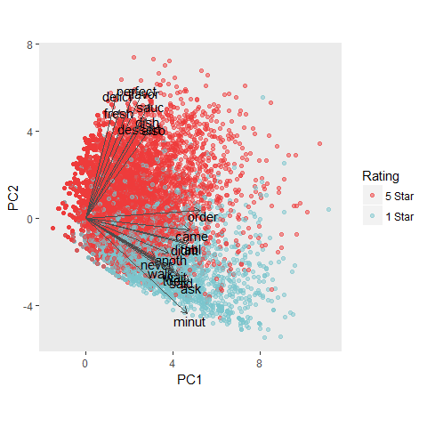
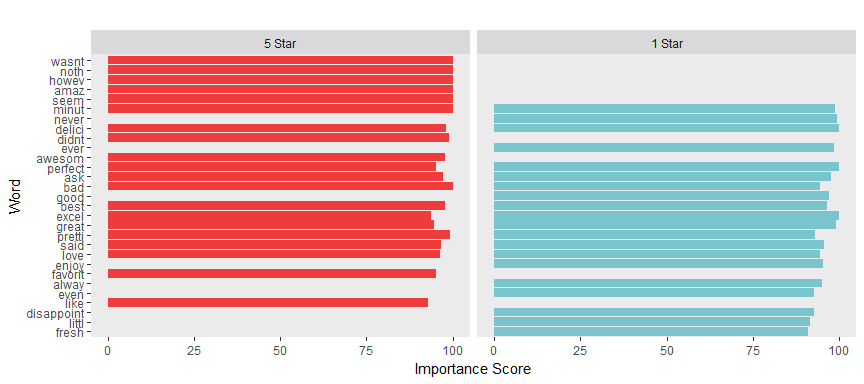

Data Science Specialization Final Report: Predicting 5-star and 1-star Ratings in Yelp Restaurant Reviews
---------------------------------------------------------------------------------------------------------

The files in this repository were used as my Capstone submission for the
Johns Hopkins Data Science Specialization. The courses in the
specialization didn't offer a lot of new material in regards to
modeling, but at the time I decided to take the specialization I was
trying to ween myself off of SAS and onto R full time. The courses in
the specialization were great for forcing my hand in that way!

I performed 12 predictive algorithms for the report (6 for 5-star
predictions and 6 for 1-star predictions). Although I didn't need to
perform so many models, I personally tend to try a lot of different
algorithms in my own work because you don't really know what's going to
work well until you try, so it only seemed natural to try many things
here too. The different algorithms employed include:

-   standard classification algorithm via rpart
-   C5.0 implementation of a standard classification algorithm
-   Random Forest model
-   Bagged Tree model
-   Gradient Boosting Machine
-   Naive Bayes model

There were specific requirements for the Capstone project that differ
from how I might typically work but the final Capstone report offers a
good overview of the material covered: [**\[Link to PDF version of
Captone
Report\]**](https://github.com/msheffer2/Data-Science-Specialization/blob/master/report/Capstone_Report.pdf)

### R syntax files I used to generate the material necessary for the report:

------------------------------------------------------------------------

-   [01 -
    Codeup.R](https://github.com/msheffer2/Data-Science-Specialization/blob/master/01%20-%20Codeup.R)
    -- takes two of the Yelp Review datasets and manipulates them in
    preparation for later use
-   [02 - Buidling the
    DTM.R](https://github.com/msheffer2/Data-Science-Specialization/blob/master/02%20-%20Building%20the%20DTM.R)
    -- creates a corpus from the reviews, cleans it, and outputs a
    document-term matrix appropriate for use as predictors in the models
    to follow
-   [03 -
    EDA.R](https://github.com/msheffer2/Data-Science-Specialization/blob/master/03%20-%20EDA.R)
    -- A subset of the exploratory data analysis performed for the
    project; only EDA used in the final report are included
-   [04 - Five Star
    Models.R](https://github.com/msheffer2/Data-Science-Specialization/blob/master/04%20-%20Five%20Star%20Models.R)
    -- syntax for conducing the 6 different models predicting if a
    rating is a 5-star rating or not
-   [05 - One Star
    Models.R](https://github.com/msheffer2/Data-Science-Specialization/blob/master/05%20-%20One%20Star%20Models.R)
    -- syntax for conducing the 6 different models predicting if a
    rating is a 1-star rating or not
-   [06 - Compiling Model
    Results.R](https://github.com/msheffer2/Data-Science-Specialization/blob/master/06%20-%20Compiling%20Model%20Results.R)
    -- this small file simply combines the various outputs into tables
    that show the predictive accuracy of the 12 models; the tables are
    used in the final report
-   [07 - Variable
    Importance.R](https://github.com/msheffer2/Data-Science-Specialization/blob/master/07%20-%20Variable%20Importance.R)
    -- a few analyses to understand what words drive rating;
    problematically, the naive Bayes was the most accurate but NB models
    don't lend themselves well to describing what predictors are
    important, so results from the C5.0 model are used as a proxy

#### Notes:

-   All of this work should be entirely replicable and should offer a
    pretty good idea of my workflow and how I like to organize my files.
-   Larger data files have been compressed and split using 7-zip
    for reproducibility.
-   Although the model syntax files are set up as if they can be run
    from start to finish, it's not likely to be used in this way due to
    the considerable amount of time required to run the models.

### Report Highlights

------------------------------------------------------------------------

Here are some brief highlights from the report:

#### EDA

------------------------------------------------------------------------

Before conducting the predictive models, I wanted to explore the data to
see if there appeared to be any noticeable link between the words used
in the reviews and the star rating. A Principal Components Map of some
of the most popular words uses in restaurant reviews in the Yelp
database suggests that while the data is multidimensional, the two
components that explain the most variation in rating show a clear
pattern toward high (5-star) reviews on the vertical dimension and low
(1-star) reviews on the horizontal dimension. There did appear to be
distinct words used in the different types of reviews.

#### 5 Star Model Results

------------------------------------------------------------------------

The training results for the 5-star models suggest that most of the
models do a pretty good job of identifying if the review is a 5-star
review or not. All have an accuracy of over 69% but accuracy can be
misleading; because there are so many non-5-star reviews in the data,
accuracy can be inflated by predicting mostly non-star reviews. The test
accuracy drops as one might expect but all are still rather accurate in
that they correctly predict the review between 69% and 76% of the time.
Only one model, though, achieve a high success rate y correctly
identifying the 5-star reviews as evidenced by a high sensitivity rating
compared to the others.

##### Training Data

<table style="width:92%;">
<colgroup>
<col width="19%" />
<col width="18%" />
<col width="19%" />
<col width="19%" />
<col width="15%" />
</colgroup>
<thead>
<tr class="header">
<th align="center">Model</th>
<th align="center">Train Acc.</th>
<th align="center">Train Sens.</th>
<th align="center">Train Spec.</th>
<th align="center">Train AUC</th>
</tr>
</thead>
<tbody>
<tr class="odd">
<td align="center">CART</td>
<td align="center">69.2%</td>
<td align="center">32.7%</td>
<td align="center">87.7%</td>
<td align="center">61.2%</td>
</tr>
<tr class="even">
<td align="center">C5.0</td>
<td align="center">79.8%</td>
<td align="center">63.4%</td>
<td align="center">88.1%</td>
<td align="center">85.8%</td>
</tr>
<tr class="odd">
<td align="center">Random Forest</td>
<td align="center">98.4%</td>
<td align="center">96.7%</td>
<td align="center">99.2%</td>
<td align="center">98.8%</td>
</tr>
<tr class="even">
<td align="center">Bagged Tree</td>
<td align="center">99.3%</td>
<td align="center">98.5%</td>
<td align="center">99.6%</td>
<td align="center">99.1%</td>
</tr>
<tr class="odd">
<td align="center">GBM</td>
<td align="center">69%</td>
<td align="center">13.8%</td>
<td align="center">97%</td>
<td align="center">71.5%</td>
</tr>
<tr class="even">
<td align="center">Naive Bayes</td>
<td align="center">74.9%</td>
<td align="center">82.5%</td>
<td align="center">71%</td>
<td align="center">87.5%</td>
</tr>
</tbody>
</table>

##### Test Data

<table style="width:86%;">
<colgroup>
<col width="19%" />
<col width="16%" />
<col width="18%" />
<col width="18%" />
<col width="13%" />
</colgroup>
<thead>
<tr class="header">
<th align="center">Model</th>
<th align="center">Test Acc.</th>
<th align="center">Test Sens.</th>
<th align="center">Test Spec.</th>
<th align="center">Test AUC</th>
</tr>
</thead>
<tbody>
<tr class="odd">
<td align="center">CART</td>
<td align="center">69.1%</td>
<td align="center">32.6%</td>
<td align="center">87.7%</td>
<td align="center">61.2%</td>
</tr>
<tr class="even">
<td align="center">C5.0</td>
<td align="center">75.8%</td>
<td align="center">57.3%</td>
<td align="center">85.2%</td>
<td align="center">81.4%</td>
</tr>
<tr class="odd">
<td align="center">Random Forest</td>
<td align="center">75.5%</td>
<td align="center">46.8%</td>
<td align="center">90.1%</td>
<td align="center">80.6%</td>
</tr>
<tr class="even">
<td align="center">Bagged Tree</td>
<td align="center">74.5%</td>
<td align="center">52.2%</td>
<td align="center">85.8%</td>
<td align="center">78.5%</td>
</tr>
<tr class="odd">
<td align="center">GBM</td>
<td align="center">68.9%</td>
<td align="center">13.8%</td>
<td align="center">96.9%</td>
<td align="center">71.4%</td>
</tr>
<tr class="even">
<td align="center">Naive Bayes</td>
<td align="center">74.9%</td>
<td align="center">82.5%</td>
<td align="center">71.1%</td>
<td align="center">87.6%</td>
</tr>
</tbody>
</table>

#### Varible Importance

------------------------------------------------------------------------

The importance score in this case is the percentage of samples that fall
into all terminal nodes after a split - but it's easiest to think of the
score more simply as "the higher the value, the more important the
predictor". There are some similar important words when predicting
5-star reviews as well as 1-star reviews but there are also some that
are unique to each model. Word stems like wasnt, noth, amaz, didnt,
awesome, favorit, and like are important and unique to predicting 5-star
ratings. Word stems like never, ever, good, enjoy, alway, even,
disappoint, little, and fresh are important and unique to predicting
1-star ratings.

Technically, the PDF Capstone Report was all that was required but I
also submitted a github repository for those interested in seeing my
syntax, which I've recreated here. This repository includes most of the
datafiles required to replicate this work (excluding the original Yelp
datasets, due to file size and general availability elsewhere) and all
of the saved outputs generated via the syntax files. In addition to the
markdown document used to create the final PDF report, 7 syntax files
are provided describing the workflow.
